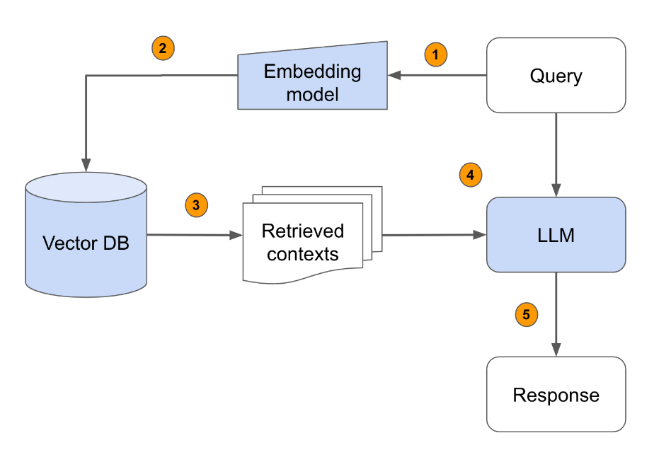

# RCT RAG

Welcome to the **RCT RAG** project!

**Access the web app for free here :**  
➡️ [RCT_Search_Engine](https://rct-rag.onrender.com/)

Try for example: `cryoglobulinemia vasculitis double-blind study`

---

📖 **Full documentation available here:**  
➡️ [RCT RAG Documentation](https://ohassanaly.github.io/rct_rag/)

---

## Project Overview

This project provides several search engines to explore **Randomized Clinical Trial (RCT) protocols** developed at **URC Saint Louis**.

Currently, it includes:

- **Sparse Search (TF-IDF)** → semantic keyword-based retrieval  
- **Exact Search (CTRL+F style)** → strict word matching with wildcard and operators (AND, OR)
- **Database-like Explorer** → direct browsing of the full files

---

## Dataset

- **40 protocols available** at the moment  
- The collection will continue to grow over time

<!--  -->