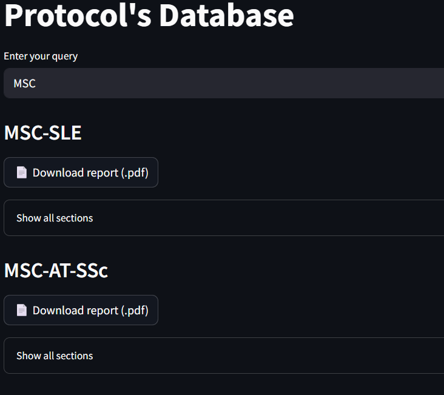
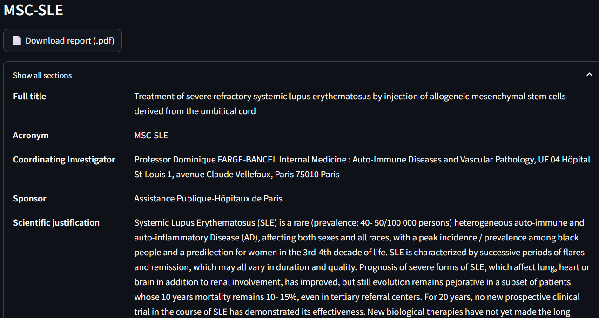

### Query

The database engine allows you to directly browse and consult all available protocols. Unlike the search engines, it does not rank studies by relevance—it provides a straightforward view of the stored documents.

You can query specific documents using keywords, e.g., `MSC`.

### Display

The interface includes:

1. **List of all protocols** – each entry shows the study title.  
2. **Document access** – open any study to read its full text.  
3. **Downloadable PDFs** – download the protocol in PDF format.

This engine is designed for easy exploration and consultation of the complete protocol database without performing a relevance-based search.
