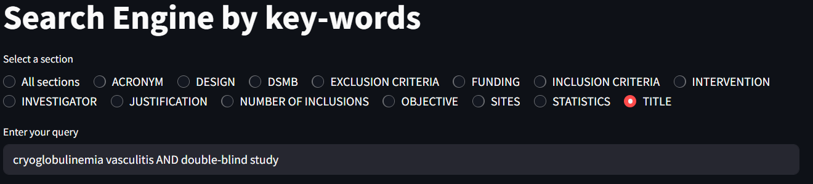
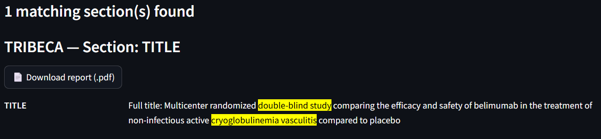

### Query

The exact search engine supports logical operators and wildcards to refine your search:

- **Simple multi-word queries** – if you enter multiple words without operators, they must appear exactly as typed and consecutively.  
- **AND** – all terms connected with `AND` must appear at least once in the section for it to match.  
- **OR** – at least one of the terms connected with `OR` must appear for a match.  
- **Wildcard (`*`)** – placing an asterisk at the end of a word allows matching any term starting with that prefix. For example, `intervent*` will match `intervention`, `interventions`, or `interventive`.  
- **Brackets (`()`)** – currently not implemented.

These operators allow more flexible and precise querying of the protocol sections.

**Example**: `cryoglobulinemia vasculitis AND double-blind study`

### Sections
As shown, you can select a single section or all sections. Selecting multiple individual sections at once is not supported yet.

### Display

The results are displayed as:

1. **Number of studies** – shows how many protocols or sections (if all sections are selected) match your query.
2. **List of studies or sections** – with the occurrences of your query terms **highlighted**.
3. **Downloadable PDFs** – download the protocol in PDF format.

