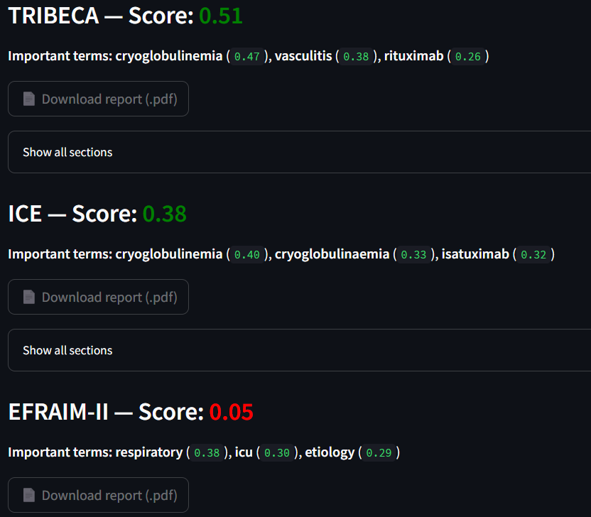

### Query

The results do not always contain all the query terms: a study can rank first even if only some of the words are present, as long as those terms are highly relevant.

**Example**: `cryoglobulinemia vasculitis double-blind study`

### Preprocess

Each query goes through a **preprocessing pipeline** to normalize and clean the data before searching.  

The main steps are:

1. **Unicode normalization** – remove accents and special characters.  
2. **Acronym expansion** – replace acronyms (both generic like `vs → versus` and study-specific ones) by their definitions.  
3. **Roman numeral handling** – convert expressions such as `Grade IV` or `Phase II` into numeric equivalents (`Grade4`, `Phase2`).  
4. **Lemmatization** – reduce words to their base form (e.g., *studies* → *study*, *blinded* → *blind*).  
5. **Stopword** – filter out common words (`the`, `and`, `or`, ...)
6. **Digit and noise cleaning** – remove standalone numbers, patterns like `d14`, `w2`, `m6`, and measurement expressions (`10mg`, `3ml`, …).
7. **Final filtering** – lowercase everything, remove punctuation, and return a clean text.  

This ensures that queries and documents are normalized, making matches more accurate and robust across variations in writing.

For our example : 

You have to validate to display results

### Display

The results are displayed as:

1. **A score graph** showing the top-ranked protocols for your query.  
2. **A list of matching studies** with their titles and metadata.  
3. **Downloadable PDFs** – download the protocol in PDF format.

For each study, you can open the document and view the **highlighted occurrences** of your search terms:  

