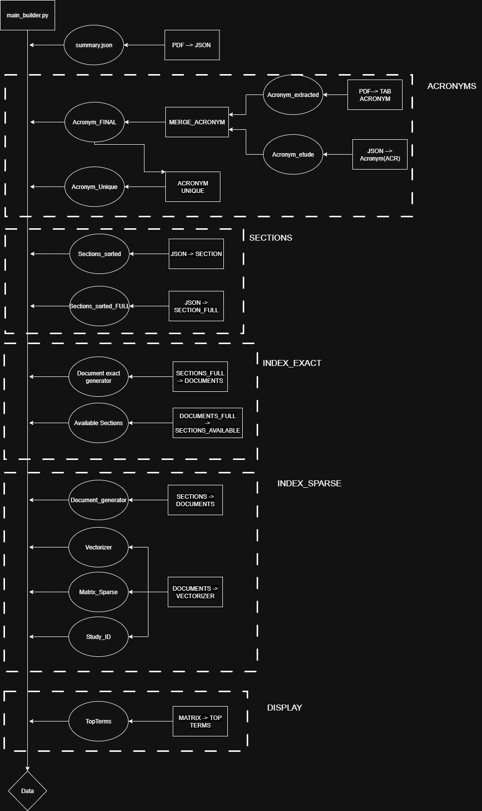

**1. Builder**: This module is responsible for data preparation and the construction of search indexes. It contains:  

- `acronyms`: management and extraction of acronyms found in the protocols.  
- `config`: configuration files for data processing and index building.  
- `data`: storage of source files and datasets.  
- `exact_engine` and `sparse_engine`: modules for building keyword-based and TF-IDF search engines.  
- `extract_pdf`: extraction of text from PDF files.  
- `sections_regroup`: organization and regrouping of document sections.  
- `utils`: utility functions for preprocessing and data handling.  

The script `main_builder.py` orchestrates the entire process of database and index construction.  
